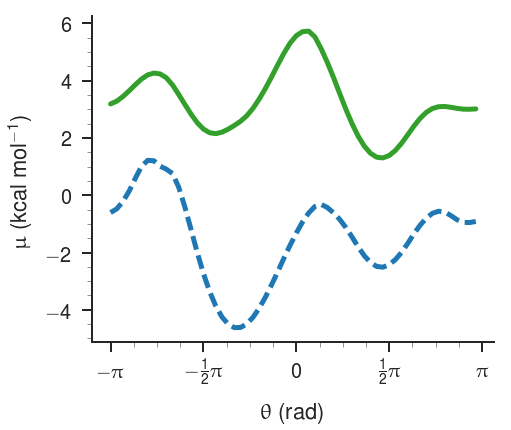
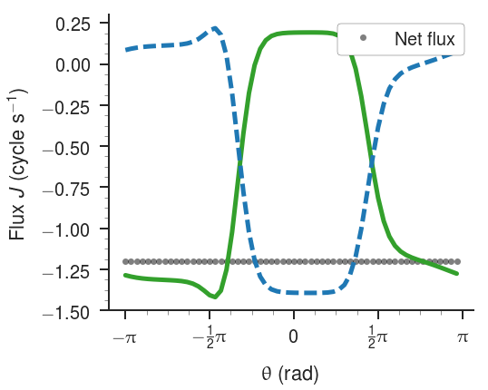
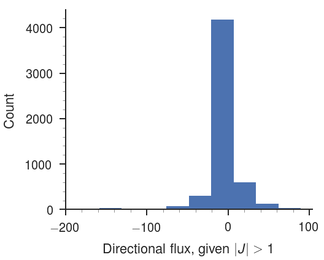
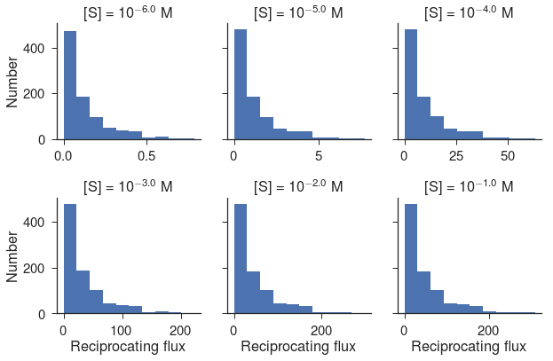
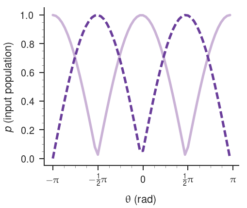
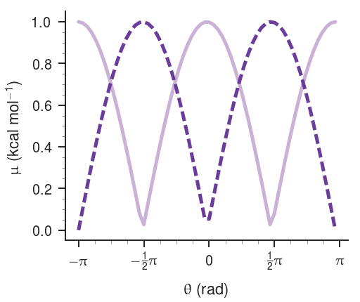

# Source code for "The ubiquity of directional and reciprocating motion in enzymes out of equilibrium"
These `jupyer` notebooks, and associated `python` 3 source code, can be used to
generate the figures in *The ubiquity of directional and reciprocating motions
in enzymes out of equilibrium* by Slochower and Gilson, 2017. We have several
other notebooks used to explore the data -- that are not hosted here -- and are
happy to share them. Please feel free to contact `slochower@gmail.com` for
details.

## Step 0: MD simulations
This code does not prepare or perform any of the MD simulations. We assume that
two separate equilibrium simulations have been completed for each system: one in
the apo (substrate-not-bound) form, and one in the substrate-bound form. In the
system we tested, 1 μs of simulation time was sufficient for the dihedral
histograms to converge, but this likely depends on the protein and simulation
details.

## Step 1: Generate probability histograms from MD data The perl script
`generate-dihedral-histogram-input-files.pl` can be used to generate an input
file for `cpptraj` that will create one file per torsion of interest. The torsions are defined in the `perl` script and use AMBER FF14SB atom types. The output files from `cpptraj` contain the equilibrium probability distribution of each torsion for a given trajectory; the script will need to be run separately for apo and substrate-bound trajectories.

The easiest way to run the `perl` script is to start with a PDB file for one protein structure and get a list of the residues by grepping for the `CA` atoms:

```bash
echo "parm <system.prmtop>" > cpptraj.in
echo "trajin <system.trajectory>" >> cpptraj.in
grep CA <system.pdb> | awk '{print $5,$4}' | xargs -L 1 \
perl generate-dihedral-histogram-input-files.pl >> cpptraj.in
```

### Assumptions
- There is an AMBER style parameter file and AMBER format trajectory. As far as I know, this can also be accomplished using Gromacs tools.
- The apo and substrate-bound structures are a perfect residue-for-residue match.
- There are no non-standard amino acids (they will simply be omitted).
- `cpptraj` may complain about the phi and psi angles of the first and last residue.
- Like the previous point, if there are discontinuities in the protein, the input file may require adjustment.

### Output
- Files of format `{torsion}{RES}{ID}.dat` that contain two columns: the first column is the angular value (in degrees) of bin $i$, and the second column is the probability of being between bin $i$ and $i+1$ averaged over the trajectory.

## Step 2: Configure the code


Create a conda environment using `conda env create -f build/environment.yaml`.


All of the data processing and model-building is carried out in `simulation.py` using the class `Simulation()`. For each system, four pieces of information need to be configured:

1. The path to the torsion histograms (produced in step 1 or otherwise). If the format of the histograms is not as described, the `np.genfromtxt` calls in the function `simulate()` can be modified.
2. The parameter `C_intersurface` -- which is the same as `k_on` in the manuscript -- the bimolecular on rate for the substrate and enzyme. This should be specified in units of per molar per second.
3. The parameter `offset_factor` -- which is the same as `mu_offset^*` in the manuscript -- the effective free energy offset of the apo system. This should be specified in units of kcal per mol.
4. The parameter `catalytic_rate` -- which is the same as `k_cat` in the manuscript -- the catalytic rate of the enzyme. This should be specified in units of per second.

These four parameters are defined in the `__init()__` function of the class and have corresponding values for each `data_source`. They are already populated with default values for PKA, ADK, and HIVP. See Supplementary Tables 1 and 2 in the manuscript for more information.

Note that these parameters can be overridden at run time, as shown below.

## Step 3: Run the code
There are basically two ways to interact with this code. The first is to poke around and look at individual files. The second is to generate the flux, power, and torque data for all the files over a range of parameters (e.g., substrate concentration), store or save that data, and then take specific views of the sliced data. This approach was used to generate the threshold plots in the manuscript.

### Inspect an individual torsion
To look at a particular torsion, we need only to specify the data set and the name of the torsion.

```python
this = Simulation(data_source = 'adk_md_data')
this.name = 'chi2THR175'
this.simulate()
```
By calling `plot_energy(this)`, we can see the free energy surface:


...and by calling `plot_flux(this)`, we get the probability flux along each surface:



Other plotting routines are in `plot.py`. Any of the class properties can be accessed after calling `simulate()`; here is a partial list:

- `unbound_population`, `bound_population`: The normalized probability distributions along either surface, read from the input files.
- `tm`: The Markov transition matrix that contains the fractional probability flow in time `dt`. 
- `ss`: The nonequilibrium steady-state across both surfaces.
- `flux_u, flux_b`: Probability flux along the apo and bound surface.
- `flux_ub`: Probability flux between the two surfaces.

### Generate statistics for a group of torsions
The easiest way to look at distributions in the data is to first scan through the files, record the interesting results, and then plot. The notebook `scan-concentrations` is a good template for how to populate a `pandas` dataframe with flux, power, and torque for a group of files over a range of substrate concentration. These can then be used to make complex views into the data, such as the number of torsions with $J < 1$ and $J_R > 1$ at a particular concentration.

To facilitate data exploration, I've included `pickle` files used to make the figures in the manuscript.

- `adk-concentration-scan.pickle`
- `pka-concentration-scan.pickle`
- `hiv-concentration-scan-catalytic-rate-10.pickle`
- `hiv-concentration-scan-catalytic-rate-200.pickle`

Then, it is easy to slice the data for particular quantities of interest:

```python
df = pd.read_pickle('adk-concentration-scan.pickle')
fig = plt.figure(figsize = (6 * 1.2, 6))
ax = df[df['Directional flux'].abs() > 1]['Directional flux'].plot(kind='hist')
ax.set_xlabel('Directional flux, given $|J| > 1$')
ax.set_ylabel('Count')
paper_plot(fig)
```


...or make a facet plot across a concentration range:

```python
tmp = tmp[(tmp['Concentration'] == -6) |
    (tmp['Concentration'] == -5) |
    (tmp['Concentration'] == -4) |
    (tmp['Concentration'] == -3) |
    (tmp['Concentration'] == -2) |
    (tmp['Concentration'] == -1) ]

g = sns.FacetGrid(tmp, col='Concentration', col_wrap=3, sharex=False)
sns.set(style="ticks", font_scale=1.5)
g = g.map(plt.hist, 'Driven flux')\
          .set_axis_labels(r'Reciprocating flux', r'Number')\
          .set_titles(r'[S] = $10^{{ {col_name} }}$ M')
g.fig.tight_layout(w_pad=1)
```


Another useful feature is the ability to filter on the dataframe. 
Here is a list of angles that have directional flux magnitude below 1 cycle per second
with driven flux greater than 1 cycle per second, at a substrate concentration of 0.001 M:

```python
tmp = df.round({'Concentration': 2})
tmp = tmp[tmp['Concentration'] == -3.0]
tmp[(tmp['Directional flux'].abs() < 1) & (tmp['Driven flux'] > 1)].head(5)
```
<div>
<table border="1" class="dataframe">
  <thead>
    <tr style="text-align: right;">
      <th></th>
      <th>Concentration</th>
      <th>Directional flux</th>
      <th>Driven flux</th>
      <th>File</th>
      <th>Intersurface flux</th>
      <th>Max load</th>
      <th>Max power</th>
      <th>ResID</th>
    </tr>
  </thead>
  <tbody>
    <tr>
      <th>27090</th>
      <td>-3.0</td>
      <td>-0.144208</td>
      <td>10.573240</td>
      <td>chi1ALA11</td>
      <td>3.059189</td>
      <td>0.0</td>
      <td>0.0</td>
      <td>11</td>
    </tr>
    <tr>
      <th>27091</th>
      <td>-3.0</td>
      <td>-0.007508</td>
      <td>3.124329</td>
      <td>chi1ALA127</td>
      <td>1.412363</td>
      <td>0.0</td>
      <td>0.0</td>
      <td>127</td>
    </tr>
    <tr>
      <th>27092</th>
      <td>-3.0</td>
      <td>-0.032975</td>
      <td>7.072458</td>
      <td>chi1ALA17</td>
      <td>2.718294</td>
      <td>0.0</td>
      <td>0.0</td>
      <td>17</td>
    </tr>
    <tr>
      <th>27093</th>
      <td>-3.0</td>
      <td>0.014157</td>
      <td>4.480657</td>
      <td>chi1ALA176</td>
      <td>1.624334</td>
      <td>0.0</td>
      <td>0.0</td>
      <td>176</td>
    </tr>
    <tr>
      <th>27094</th>
      <td>-3.0</td>
      <td>0.013930</td>
      <td>1.639636</td>
      <td>chi1ALA186</td>
      <td>0.580522</td>
      <td>0.0</td>
      <td>0.0</td>
      <td>186</td>
    </tr>
  </tbody>
</table>
</div>


### Advanced usage

#### Change the default parameters
It is easy to change the default parameters before running `simulate()`. For example, to change the catalytic rate for ADK:

```python
this = Simulation(data_source = 'adk_md_data')
this.name = 'chi2THR175'
this.catalytic_rate = 100  # Instead of 312 per second
this.simulate()
```

#### Use a toy model
Another way to explore the data is by using toy models. One example of this may be setting
the apo and bound populations to something simple. Note that the other parameters still need 
to be specified when using `data_source='manual'`.

```python
this = Simulation(data_source='manual')
this.unbound_population = [abs(np.cos(i)) for i in np.linspace(0, 2*np.pi, 60)] 
this.bound_population = [abs(np.sin(i)) for i in np.linspace(0, 2*np.pi, 60)]

this.offset_factor = 0
this.C_intersurface = 10**6
this.catalytic_rate = 100
this.cSubstrate = 10**6
this.simulate()

plot_input(this)
```



#### Specify energies directly
Using `data_source = 'manual'` makes it easy to bypass specifying populations entirely
and directly work with energies. This can be handy for testing the model without MD data. 
We accomplish this by passing the parameter `user_energies=True` so the function
`data_to_energy()` isn't called by `simulate()`.

```python
this = Simulation(data_source='manual')
this.unbound = [abs(np.cos(i)) for i in np.linspace(0, 2*np.pi, 60)] 
this.bound = [abs(np.sin(i)) for i in np.linspace(0, 2*np.pi, 60)]

this.offset_factor = 0
this.C_intersurface = 10**6
this.catalytic_rate = 100
this.cSubstrate = 10**6
this.simulate(user_energies=True)

plot_energy(this)
```

